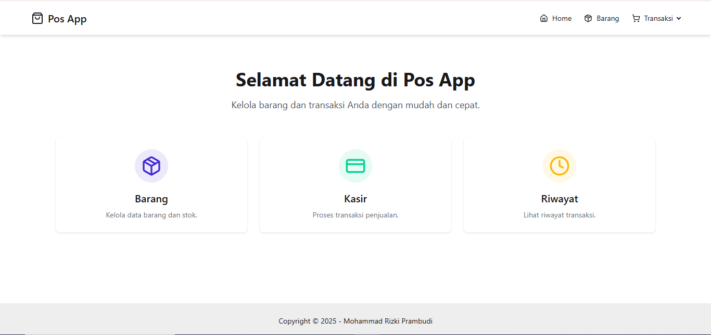
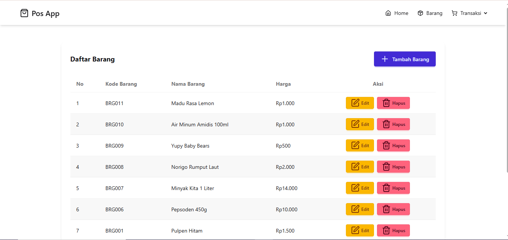
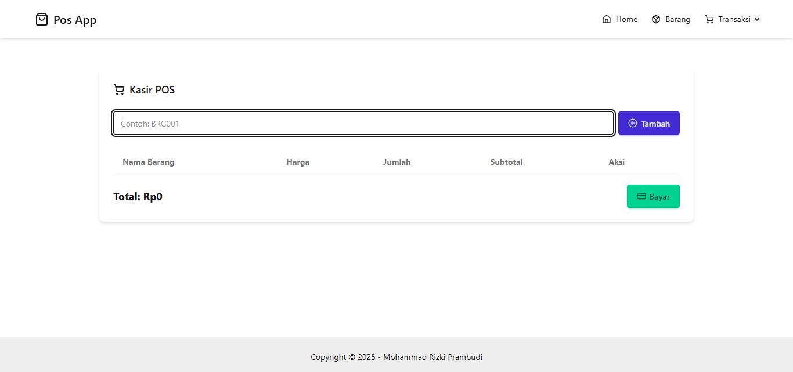
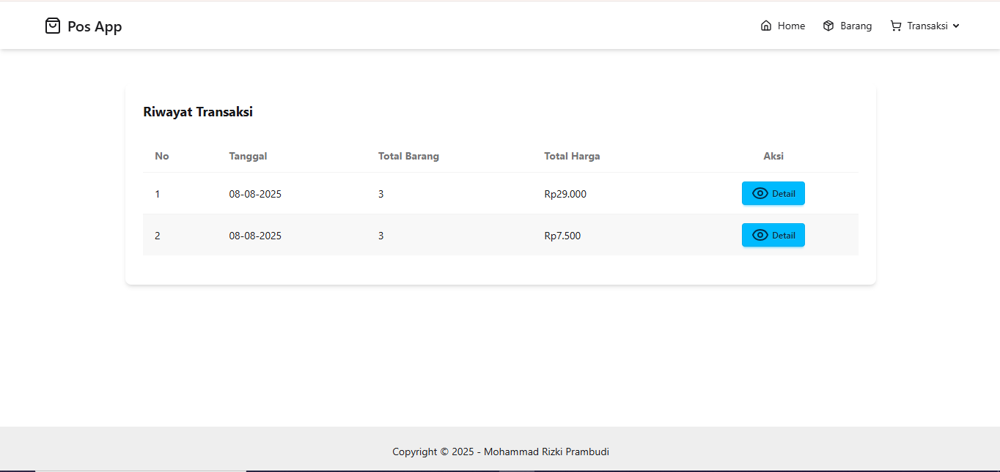

# Laravel Pos App

Aplikasi kasir sederhana berbasis **Laravel**, menggunakan **Tailwind CSS**, **DaisyUI**, dan **Lucide Icons**. Mendukung fitur tambah barang, transaksi, dan riwayat transaksi dengan modal detail.

## Teknologi yang Digunakan

-   [Laravel 10+](https://laravel.com)
-   [Tailwind CSS](https://tailwindcss.com)
-   [DaisyUI](https://daisyui.com)
-   [Lucide Icons](https://lucide.dev)
-   [MySQL](https://www.mysql.com)

---

## Instalasi

Pastikan sudah menginstal **PHP ≥ 8.1**, **Composer**, dan **Node.js**.

```bash
# 1. Clone repositori
git clone https://github.com/MohammadRizkiPrambudi/pos-app.git
cd pos-app

# 2. Install dependency PHP
composer install

# 3. Copy file .env dan atur konfigurasi database
cp .env.example .env

# 4. Buka .env atur konfigurasi database
buat database dengan nama pos-app

# 5. Generate key Laravel
php artisan key:generate

# 6. Migrasi database
php artisan migrate

# 7. jalankan Seeder
php artisan db:seed --class=BarangSeeder

# 8. Jalankan server lokal
php artisan serve

```

## Dokumentasi Home



## Dokumentasi Barang



## Dokumentasi Kasir



## Dokumentasi Riwayat Transaksi


